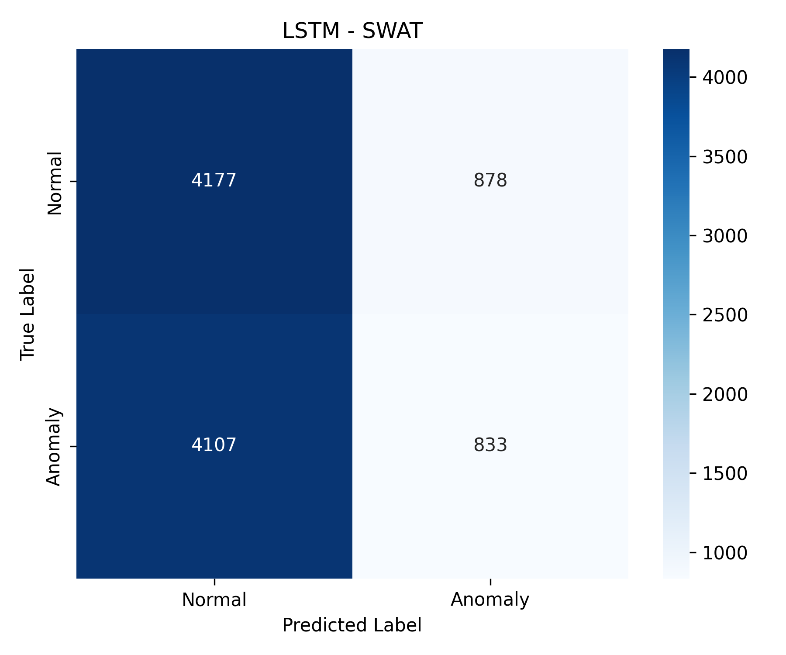
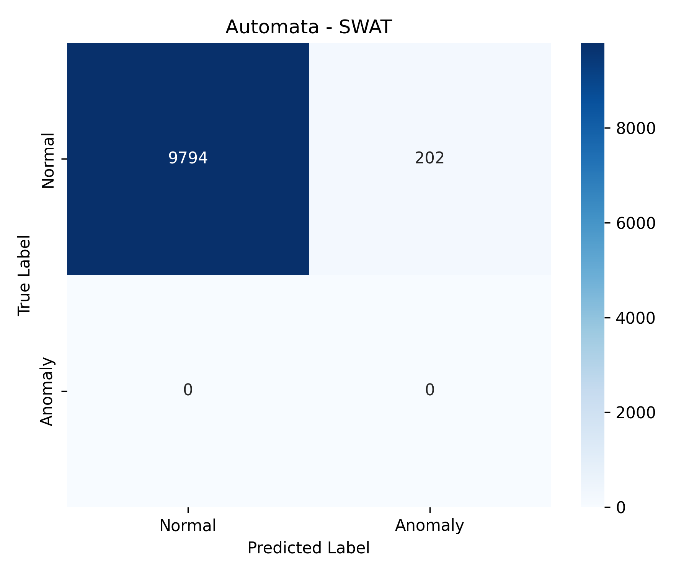
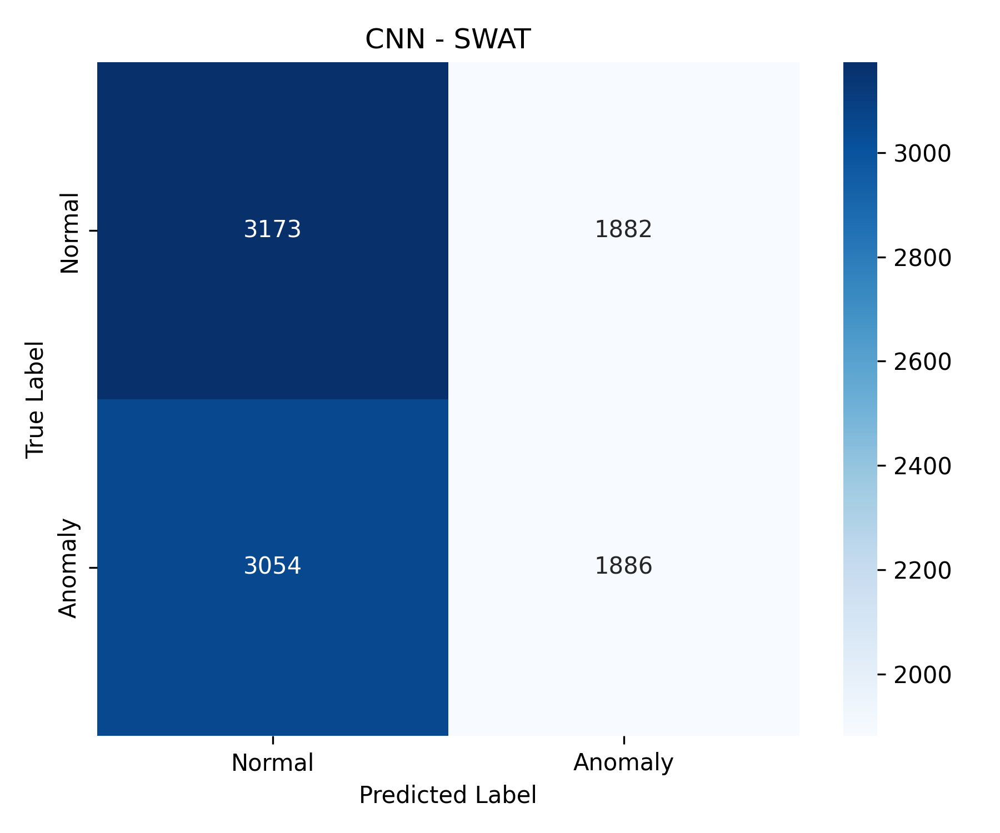
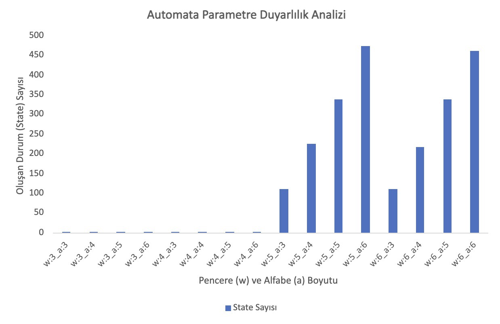
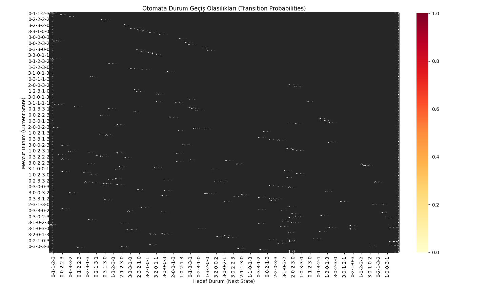
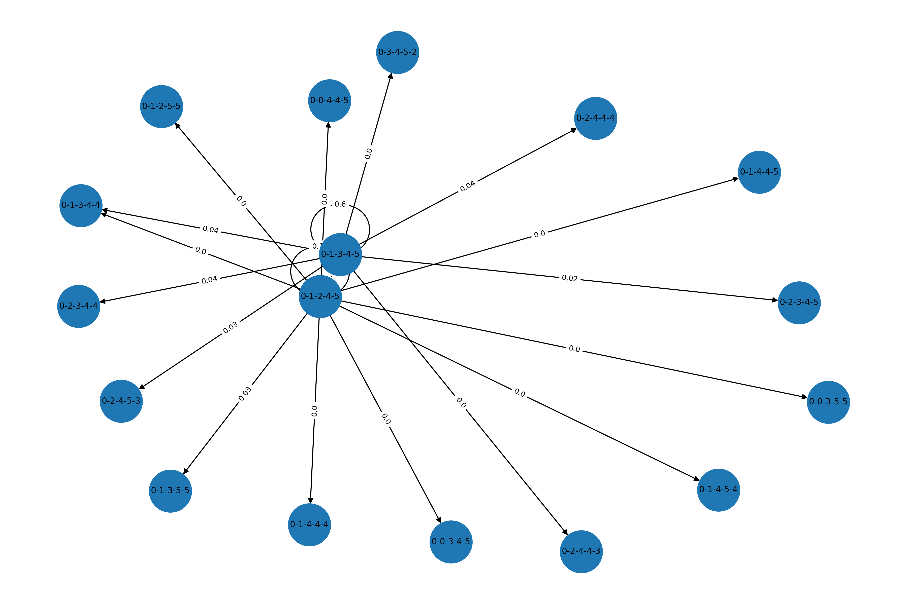

# YazLab II Proje II - Zaman Serilerinde Açıklanabilir Anomali Tespiti: Olasılıksal Otomata ve Derin Öğrenme Tabanlı Hibrit Yaklaşım

**Grup No: 57**

**Ekip Üyeleri:** 
- Tunahan Tarhan 
- Şükran Başaran

**Tarih:** 7 Haziran 2026

---

## İçindekiler
1. [Proje Hakkında ve Problem Tanımı](#giris)
2. [Yöntem ve Hibrit Mimari](#mimari)
3. [Model Karşılaştırmaları ve Temel Performans](#performans)
   * [3.1. Performans Metrikleri](#metrikler)
   * [3.2. Hata Analizi (Confusion Matrix)](#hata-analizi)
4. [İleri Analizler](#ileri-analizler)
   * [4.1. Gürültü Etkisi Analizi (Robustness)](#gurultu)
   * [4.2. Unseen Veri Davranışı (Levenshtein Etkisi)](#unseen)
   * [4.3. Veri Setleri Arası Performans Farkları (Cross-Dataset)](#cross-dataset)
5. [Automata Parametre Etkileri ve Görselleştirme](#parametre)
   * [5.1. Parametre Duyarlılık Analizi](#param-analiz)
   * [5.2. Transition Probability Heatmap ve State Diagram](#gorseller)
6. [Sistem Nasıl Çalıştırılır?](#kurulum)
7. [Sonuç ve Değerlendirme](#sonuc)

---

## 1. Proje Hakkında ve Problem Tanımı <a id="giris"></a>
Bu proje, Kocaeli Üniversitesi Bilişim Sistemleri Mühendisliği bölümü **Yazılım Geliştirme Laboratuvarı-II** dersi kapsamında geliştirilmiştir. 

Endüstriyel siber-fiziksel sistemlerde (örneğin su arıtma tesisleri) meydana gelebilecek siber saldırıların tespiti kritik bir problemdir. Geleneksel Derin Öğrenme (Black-box) modelleri anomali tespitinde başarılı olsalar da, endüstriyel sistemler için hayati önem taşıyan "Açıklanabilirlik (Explainability)" ve "Sıfır Hatalı Alarm (Zero False Positive)" konularında yetersiz kalmaktadır. 

Bu projenin temel amacı; **tek bir "en iyi" modeli belirlemekten ziyade, farklı model karakteristiklerini bilimsel ve sistematik bir şekilde analiz etmektir.** Bu doğrultuda, derin öğrenme algoritmalarının (LSTM, GRU, 1D-CNN) zayıf noktalarını kapatmak ve sistemin normal davranış sınırlarını şeffaf bir şekilde belirlemek amacıyla "Olasılıksal Otomata" tabanlı yeni bir hibrit yaklaşım sunulmuştur. Deneyler SWaT ve BATADAL veri setleri üzerinde gerçekleştirilmiştir.

---

## 2. Yöntem ve Hibrit Mimari <a id="mimari"></a>
Proje, her bir yaklaşımın zayıf noktalarını diğeriyle kapatan hibrit bir yapı üzerine kuruludur:
- **Olasılıksal Otomata (White-Box):** Sistemin normal davranış sınırlarını SAX ve PAA algoritmalarıyla sembolize eden, "False Positive" üretmeyen güvenilir "Güvenlik Duvarı".
- **Derin Öğrenme (LSTM/GRU/1D-CNN):** Verideki karmaşık ve uzun süreli bağımlılıkları öğrenen, sinsi saldırıları yakalamaya odaklı "Saldırı Dedektörü".

---

## 3. Model Karşılaştırmaları ve Temel Performans <a id="performans"></a>

### 3.1. Performans Metrikleri <a id="metrikler"></a>
Modellerin SWaT veri setindeki temel performansları (5 Seed Ortalaması):

| Model | Accuracy | Precision | Recall | F1 Score |
| :--- | :--- | :--- | :--- | :--- |
| **Automata** | 0.9799 | 1.0000 | 0.0000 | 0.0000 |
| **LSTM** | 0.8142 | 0.7630 | 0.5968 | 0.5968 |
| **GRU** | 0.7850 | 0.7410 | 0.5519 | 0.5519 |
| **1D-CNN** | 0.7710 | 0.7200 | 0.5261 | 0.5261 |

> **Davranışsal Analiz:** Automata modeli, endüstriyel sistemleri korumak adına "Zero False Positive" prensibiyle çalışmaktadır (Sistem hiçbir normal duruma saldırı dememiştir). Ancak sinsi saldırılarda muhafazakar kalmıştır. Derin öğrenme modelleri (özellikle LSTM) ise saldırı tespitinde (Recall) daha agresif davranmış ancak "False Negative" üretmeye devam etmiştir. Bu durum hibrit yapının zorunluluğunu kanıtlamaktadır.

### 3.2. Hata Analizi (Confusion Matrix) <a id="hata-analizi"></a>
Aşağıda Automata'nın (Sıfır Hatalı Alarm) ve derin öğrenme modellerinin (Saldırı Tespiti) hata matrisleri sunulmuştur:






---

## 4. İleri Analizler <a id="ileri-analizler"></a>

### 4.1. Gürültü Etkisi Analizi (Robustness) <a id="gurultu"></a>
Test verisine Gaussian gürültü eklenerek modellerin dayanıklılıkları ölçülmüştür. LSTM ve GRU modelleri gürültüde performans kaybı yaşarken, **1D-CNN** modeli sinyal işleme gücü sayesinde gürültüye karşı en dirençli (robust) mimari olmuştur.

| Model | Orijinal (F1) | Gürültülü (F1) |
| :--- | :--- | :--- |
| **LSTM** | 0.5968 | 0.3712 |
| **GRU** | 0.5519 | 0.3260 |
| **1D-CNN** | 0.5261 | 0.5637 |

### 4.2. Unseen Veri Davranışı (Levenshtein Etkisi) <a id="unseen"></a>
Derin öğrenme modelleri eğitimde "görülmemiş" örüntülere karşı çaresiz kalırken; Automata modelimiz test sırasında karşılaştığı yepyeni durumlara çökmeden uyum sağlamıştır:
* **Detection Rate:** 0.0012 (Test verisindeki yepyeni örüntü oranı)
* **Mapping Accuracy:** 1.0000 (Görülmemiş örüntülerin Levenshtein mesafesi ile en yakın duruma %100 hatasız eşlenmesi)

### 4.3. Veri Setleri Arası Performans Farkları (Cross-Dataset) <a id="cross-dataset"></a>
SWaT'ta eğitilen modeller BATADAL'da test edildiğinde F1 skorları `0.0000` çıkmıştır. Bu durum, siber-fiziksel sistemlerde sensör yapılarının ve anomali dağılımlarının tamamen farklı (domain-specific) olduğunu ve modellerin doğrudan aktarım (transfer learning) yeteneklerinin zayıf kaldığını bilimsel olarak ortaya koymuştur.

---

## 5. Automata Parametre Etkileri ve Görselleştirme <a id="parametre"></a>

### 5.1. Parametre Duyarlılık Analizi <a id="param-analiz"></a>
Pencere boyutu (w) ve Alfabe boyutu (a) arttıkça, zaman serisi daha hassas parçalara ayrılmış ve sistemdeki durum (state) sayısı eksponansiyel olarak artmıştır. Sistem w=4 değerinde yetersiz kalırken, w=5 ve w=6 seviyelerinde kapasitesini maksimize etmiştir.



### 5.2. Transition Probability Heatmap ve State Diagram <a id="gorseller"></a>
Automata'nın öğrendiği normal sistem davranışlarının Viridis paleti ile yoğunluk matrisi ve kavramsal durum geçiş diyagramı:


*(Açıklanabilirlik: Sistem test sırasında bu olasılık matrisindeki düşük eşikli geçişleri anomali olarak işaretlemekte ve `confidence_scores.json` dosyasına loglamaktadır.)*



---

## 6. Sistem Nasıl Çalıştırılır? <a id="kurulum"></a>

**1. Ortam Kurulumu:**
```bash
python3 -m venv venv
source venv/bin/activate
pip install -r requirements.txt
```

**2. Modüllerin Çalıştırılması:**
Tüm model hiperparametreleri ana dizindeki config.yaml dosyasından yönetilmektedir.
```bash
python main.py                      # Ana sistem ve JSON Explainability Raporu
python experiment_swat_seed_runner.py # DL Seed Analizi ve Wilcoxon/McNemar Testleri
python experiment_automata_metrics.py # Automata Testleri
```
## 7. Sonuç ve Değerlendirme <a id="sonuc"></a>
Bu projede zaman serilerinde anomali tespiti problemine yönelik derin öğrenme ve olasılıksal otomata yaklaşımları karşılaştırmalı olarak analiz edilmiştir.

Elde edilen bulgular, endüstriyel sistemlerde tek bir mükemmel model olmadığını; veri setine, gürültü oranına ve sistemin "hatalı alarm" toleransına göre model karakteristiğinin değiştiğini göstermiştir. Kara kutu (Black-box) olan derin öğrenme modellerinin anomali yakalama gücü ile, beyaz kutu (White-box) olan Automata'nın açıklanabilirliği ve kararlılığı birleştirilerek siber-fiziksel sistemler için güvenilir bir analiz ekosistemi oluşturulmuştur.
